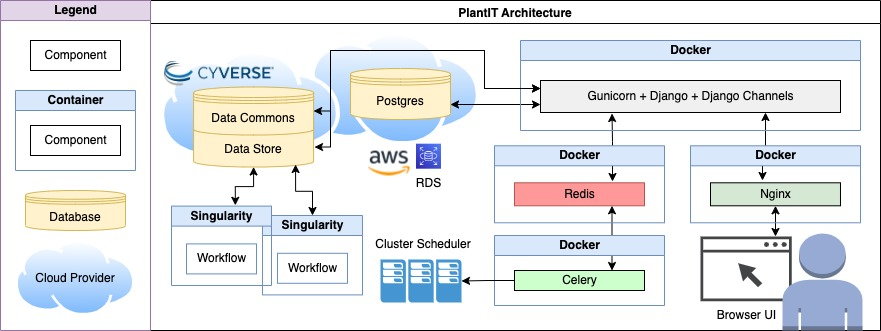
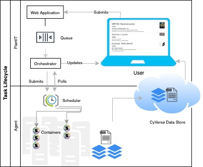
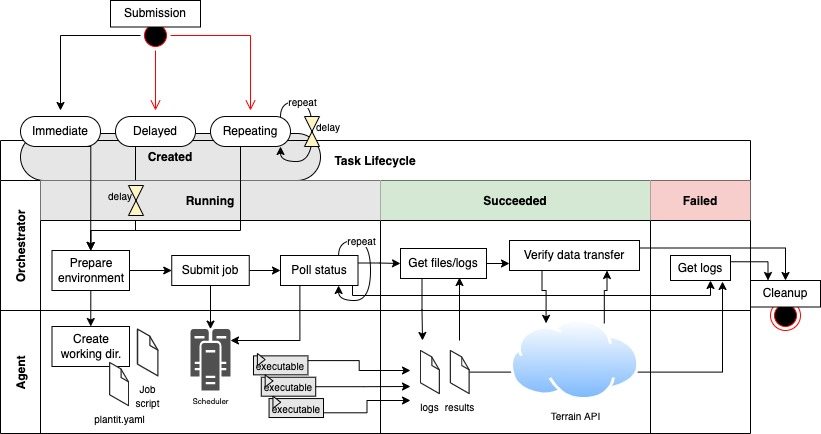
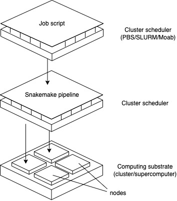

<div align="center">


<h3 align="center" style="text-decoration: underline;">
        plant<small
            class="mb-3 text-success"
            style="text-decoration: underline;text-shadow: 1px 0 0 #000, 0 -1px 0 #000, 0 1px 0 #000, -1px 0 0 #000; color: #d6df5D"
            >it</small>
</h3>

high-throughput phenotyping in the browser


[](https://plantit.readthedocs.io/en/latest/?badge=latest)
[](https://coveralls.io/github/Computational-Plant-Science/plantit?branch=master)

</div>

<!-- START doctoc generated TOC please keep comment here to allow auto update -->
<!-- DON'T EDIT THIS SECTION, INSTEAD RE-RUN doctoc TO UPDATE -->
**Contents**

- [About](#about)
  - [Status](#status)
  - [Motivation](#motivation)
  - [Overview](#overview)
  - [Features](#features)
    - [Automatic data transfers](#automatic-data-transfers)
    - [Browser submissions](#browser-submissions)
    - [Easy integration](#easy-integration)
    - [Portable workflows](#portable-workflows)
    - [Share at your pace](#share-at-your-pace)
    - [Metadata & annotation](#metadata--annotation)
- [Development](#development)
  - [Architecture](#architecture)
  - [Requirements](#requirements)
  - [Installation](#installation)
    - [Setting up a development environment](#setting-up-a-development-environment)
      - [Running tests](#running-tests)
    - [Deploying to production](#deploying-to-production)
      - [SSL Certificates](#ssl-certificates)
  - [Configuring environment variables](#configuring-environment-variables)
  - [Configuring deployment targets](#configuring-deployment-targets)
    - [Python](#python)
    - [Admin site](#admin-site)

<!-- END doctoc generated TOC please keep comment here to allow auto update -->

## About

`plantit` is a science gateway for image-based plant phenotyping. It's simultaneously a portal to clusters for researchers and a continuous delivery platform for developers. (Of course one may wear both hats.)

### Status

`plantit` is currently in public beta with the release of `v1.0.0` planned to coincide with [NAPPN 2022](https://www.plantphenotyping.org/conference-home) (Feb. 22-25). See [Releases](https://github.com/Computational-Plant-Science/plantit/releases) for changelog and [Roadmap](https://github.com/Computational-Plant-Science/plantit/wiki/Changelog-&-Roadmap) for planned features, fixes, and future releases.

### Motivation

Plant phenomics is outgrowing single-purpose desktop GUI applications. High-throughput phenotyping is resource-intensive and may demand institutional clusters or servers provisioned from a commercial cloud. This entails contact with the rapidly shifting world of workflow orchestration software, even though deployment details are often incidental to the aims of biologists. Phenomics tooling should insulate its users from nonessential concerns, freeing up time and attention for the problem domain.

### Overview

In a sentence: `plantit` runs phenomics container workflows in high-throughput computing environments (by default, [XSEDE's](https://www.xsede.org/) [Stampede2](https://www.tacc.utexas.edu/systems/stampede2) cluster). All you need to get started is a [CyVerse](https://cyverse.org/) account.

### Features

#### Automatic data transfers

`plantit` can automatically transfer data to and from the [CyVerse](https://cyverse.org/) cloud before and after processing. Plug in your own data or access public datasets from the CyVerse [Data Commons](https://cyverse.org/data-commons). `plantit` will [soon](https://github.com/Computational-Plant-Science/plantit/issues/246) also be able to omit transfers and use datasets parked on cluster filesystems.

#### Browser submissions

Choose which workflow to apply to which data, submit and monitor status, then download results, all from the browser. (A web API is [currently in development](https://github.com/Computational-Plant-Science/plantit/issues/256): users will soon be able to programmatically introspect task status as well.) Submit immediately or schedule units of work to run after a delay or on a periodic interval.

#### Easy integration

Bind your own software by packaging it into a [Docker](https://www.docker.com/) image published on [Docker Hub](https://hub.docker.com/), then [adding a `plantit.yaml` configuration file](https://plantit.readthedocs.io/en/latest/md/developer_docs/defining_workflows.html) to any public GitHub repo (like [GitHub Actions](https://github.com/features/actions) or [Travis CI](https://www.travis-ci.com/)).

#### Portable workflows

`plantit` workflows run in [Singularity](https://sylabs.io/) containers. This insulates workflows from their deployment environment and makes results easier to reproduce.

#### Share & collaborate

Keep your datasets and workflows private, share them with a small team, or publish to the entire research community.

#### Metadata & annotation

Contextualize datasets according to the emerging [MIAPPE](https://www.miappe.org/) conventions ([under development](https://github.com/Computational-Plant-Science/plantit/issues/41)).

## Development

Read on if you're interested in contributing to `plantit` or hosting your own instance somewhere.

### Architecture

An instantiation of a `plantit` workflow is called a *task*. When a task is submitted from the browser client, the `plantit` web app hands it to an internal queue feeding a background worker. When the worker picks up the task, a job script is generated and submitted to the selected cluster/supercomputer scheduler. The task lifecycle is essentially just a chain of callbacks, some of which trigger state transitions.

Architecture | Task Lifecycle    |            Task Detail             | Cluster Orchestration | 
|:---------:|:----------------------------:|:-------------------------------------:|:-----------------------:|
 |   |  |  


### Requirements

The following are required to develop or deploy `plantit` in a Unix environment:

- [Docker](https://www.docker.com/)
- [npm](https://www.npmjs.com/get-npm)

### Installation

First, clone the repository:

```bash
git clone https://github.com/Computational-Plant-Science/plantit.git
```

#### Setting up a development environment

To set up a new (or restore a clean) development environment, run `scripts/bootstrap.sh` from the project root (you may need to use `chmod +x` first). You can use the `-n` option to disable the Docker build cache. This command will:

- Stop and remove project containers and networks
- If an `.env` file (to configure environment variables) does not exist, generate one with default values
- Build the Vue front end
- Build Docker images
- Run migrations

Then bring everything up with `docker-compose -f docker-compose.dev.yml up` (`-d` for detached mode).

This will start a number of containers:

- `plantit`: Django web application (`http://localhost:3000`)
- `postgres`: PostgreSQL database
- `celery`: Celery background worker
- `flower`: Flower web UI for Celery (`http://localhost:5555`)
- `redis`: Redis instance (caching, Celery message broker)
- `sandbox`: Ubuntu test environment

The Django admin interface is at `http://localhost:3000/admin/`. To use it, you'll need to log into the site at least once (this will create a Django account for you), then shell into the `plantit` container, run `./manage.py shell`, and update your profile with staff/superuser privileges. For instance:

```python
from django.contrib.auth.models import User
user = User.objects.get(username=<your CyVerse username>)
user.is_staff = True
user.is_superuser = True
user.save()
```

You can also run `./scripts/configure-superuser.sh -u <your CyVerse username>` to accomplish the same thing.

Note that the bootstrap script will not clear migrations. To restore to a totally clean database state, you will need to remove all `*.py` files from the `plantit/plantit/migrations` directory (except for `__init__.py`).

##### Running tests

Once the containers are up, tests can be run with `docker-compose -f docker-compose.dev.yml exec plantit ./manage.py test`.

#### Deploying to production

In production configuration, NGINX serves static assets and reverse-proxies Django via Gunicorn (both in the same container).

To configure PlantIT for deployment, first clone the repo, then, from the root directory, run:

```
chmod +x /scripts/deploy.sh
./scripts/deploy.sh <configuration ('rc' or 'prod')> <host IP or FQDN> <admin email address>
```

This script is idempotent and may safely be triggered to run by e.g., a CI/CD server. This will:

- Bring containers down
- Fetch the latest version of the project
- Pull the latest versions of Docker containers
- Build the Vue front end
- Collect static files
- Configure NGINX (replace `localhost` in `config/ngnix/conf.d/local.conf` with the host's IP or FQDN, configured via environment variable)
- Update environment variables (disable debugging, enable SSL and secure cookies, etc)
- Bring containers up
- Run migrations

At this point the following containers should be running:

- `nginx`: NGINX server (reverse proxy)
- `plantit`: Django web application behind Gunicorn (`http://localhost:80`)
- `postgres`: PostgreSQL database
- `celery`: Celery background worker
- `redis`: Redis instance

##### SSL Certificates

PlantIT uses [Let's Encrypt](https://letsencrypt.org/) and [Certbot](https://certbot.eff.org/) for SSL certification. The production configuration includes a `certbot` container which can be used to request new or renew existing certificates from Let's Encrypt. Standard certificates last 90 days.

In production the `certbot` container is configured by default to automatically renew certs when necessary:

```yaml
certbot:
  image: certbot/certbot
  volumes:
    - ./config/certbot/conf:/etc/letsencrypt/
    - ./config/certbot/www:/var/www/certbot
  entrypoint: "/bin/sh -c 'trap exit TERM; while :; do certbot renew; sleep 24h & wait $${!}; done;'"
```

To manually request a new certificate, run:

```shell
docker-compose -f docker-compose.prod.yml run certbot
```

To renew an existing certificate, use the `renew` command, then restart all containers:

```shell
docker-compose -f docker-compose.prod.yml run certbot renew
docker-compose -f docker-compose.prod.yml restart
```

Use the `--dry-run` flag with any command to test without writing anything to disk.

### Configuring environment variables

Docker will read environment variables in the following format from a file named `.env` in the project root directory (if the file exists):

```
key=value
key=value
...
```

`bootstrap.sh` will generate an `.env` file like the following if one does not exist:

```
VUE_APP_TITLE=plantit
MAPBOX_TOKEN=<your Mapbox token>
MAPBOX_FEATURE_REFRESH_MINUTES=60
CYVERSE_REDIRECT_URL=http://localhost:3000/apis/v1/idp/cyverse_handle_temporary_code/
CYVERSE_CLIENT_ID=<your cyverse client id>
CYVERSE_CLIENT_SECRET=<your cyverse client secret>
CVVERSE_USERNAME=<your cyverse username>
CYVERSE_PASSWORD=<your cyverse password>
CYVERSE_TOKEN_REFRESH_MINUTES=60
NODE_ENV=development
DJANGO_SETTINGS_MODULE=plantit.settings
DJANGO_SECRET_KEY=<your django secret key>
DJANGO_DEBUG=True
DJANGO_API_URL=http://plantit:3000/apis/v1/
DJANGO_SECURE_SSL_REDIRECT=False
DJANGO_SESSION_COOKIE_SECURE=False
DJANGO_CSRF_COOKIE_SECURE=False
DJANGO_ALLOWED_HOSTS=*
DJANGO_ADMIN_USERNAME=<your django admin username>
DJANGO_ADMIN_PASSWORD=<your django admin password>
DJANGO_ADMIN_EMAIL=<your django admin email>
TASKS_TEMPLATE_SCRIPT_SLURM=/code/scripts/template_slurm_run.sh
USERS_CACHE=/code/users.json
USERS_REFRESH_MINUTES=60
USERS_STATS_REFRESH_MINUTES=10
STATS_WINDOW_WIDTH_DAYS=30
MORE_USERS=/code/more_users.json
AGENT_KEYS=/code/agent_keys
WORKFLOWS_CACHE=/code/workflows.json
WORKFLOWS_REFRESH_MINUTES=60
TASKS_LOGS=/code/logs
TASKS_TIMEOUT_MULTIPLIER=2
TASKS_STEP_TIME_LIMIT_SECONDS=20
LAUNCHER_SCRIPT_NAME=launch
INPUTS_FILE_NAME=inputs.txt
ICOMMANDS_IMAGE=computationalplantscience/icommands
SQL_ENGINE=django.db.backends.postgresql
SQL_HOST=postgres
SQL_PORT=5432
SQL_NAME=postgres
SQL_USER=postgres
SQL_PASSWORD=<your database password>
GITHUB_AUTH_URI=https://github.com/login/oauth/authorize
GITHUB_REDIRECT_URI=http://localhost:3000/apis/v1/users/github_handle_temporary_code/
GITHUB_SECRET=<your github secret>
GITHUB_CLIENT_ID=<your github client ID>
DOCKER_USERNAME=<your docker username>
DOCKER_PASSWORD=<your docker password>
NO_PREVIEW_THUMBNAIL=/code/plantit/front_end/src/assets/no_preview_thumbnail.png
AWS_ACCESS_KEY=<your AWS access key>
AWS_SECRET_KEY=<your AWS secret key>
AWS_REGION=<your AWS region>
AWS_FEEDBACK_ARN=<your AWS feedback ARN>
AGENTS_HEALTHCHECKS_MINUTES=5
AGENTS_HEALTHCHECKS_SAVED=12
TUTORIALS_FILE=/code/tutorials.pdf
FEEDBACK_FILE=/code/feedback.pdf
CELERY_AUTH=user:password
HTTP_TIMEOUT=15
```

Note that the following environment variables must be supplied manually:

- `MAPBOX_TOKEN`
- `CYVERSE_CLIENT_ID`
- `CYVERSE_CLIENT_SECRET`
- `CVVERSE_USERNAME`
- `CYVERSE_PASSWORD`
- `GITHUB_CLIENT_ID`
- `GITHUB_SECRET`
- `AWS_ACCESS_KEY`
- `AWS_SECRET_KEY`
- `AWS_REGION`
- `AWS_FEEDBACK_ARN`
  
Several others will be auto-generated by `scripts/bootstrap.sh` in a clean install directory:

- `DJANGO_ADMIN_PASSWORD`
- `DJANGO_SECRET_KEY`
- `SQL_PASSWORD`

Some variables must be reconfigured for production environments (`scripts/deploy` will automatically do so):

- `NODE_ENV` should be set to `production`
- `DJANGO_DEBUG` should be set to `False`
- `DJANGO_SECURE_SSL_REDIRECT` should be set to `True`
- `DJANGO_API_URL` should point to the host's IP or FQDN

### Configuring deployment targets

An agent is an abstraction of a computing resource, such as a cluster or supercomputer. `plantit` interacts with agents via key-authenticated SSH and requires the SLURM scheduler to be installed. (Support for additional schedulers is in development.)

Deployment targets may be configured programmatically or with the Django admin interface. To configure an agent via the Django admin site, make sure you're logged into `plantit`, then navigate to `http://localhost:3000/admin/` (`https://<host>/admin/` in production). Select the `Agents` tab on the left side of the screen, then `Add Agent`.

On many clusters it is customary to configure dependencies on a per-user basis with a module system, e.g. `module load <some software>`. The `pre_commands` agent property is the place for commands like these: when provided, they will be prepended to all commands `plantit` sends to the cluster for job orchestration.

#### Agent requirements

`plantit` deployment targets must run some Linux distribution with either the `sh` or `bash` shells available. Only 2 dependencies are required:

- SLURM
- Singularity

`plantit` tasks expect standard SLURM commands (e.g., `sbatch`, `scancel`) to be available. Singularity must also be installed and available on the `$PATH`.

#### Authenticating with Docker

Docker Hub applies rate limits to unauthenticated users. These are easy to meet or exceed, since Singularity queries the Docker API on each `singularity exec docker://<some container>`. It is recommended to use `singularity remote login --username <your Docker username> docker://docker.io` with a paid Docker account: this will cache your Docker credentials on the deployment target for Singularity to use thereafter.
