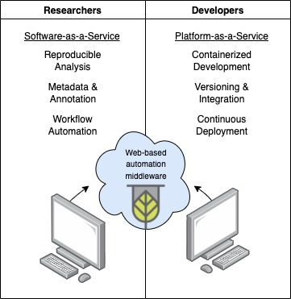

<div align="center">


<h1 align="center"
    style="text-decoration: underline;">
        plant<small
            class="mb-3 text-success"
            style="text-decoration: underline;text-shadow: 1px 0 0 #000, 0 -1px 0 #000, 0 1px 0 #000, -1px 0 0 #000; color: #d6df5D"
            >IT</small>
</h1>

HPC/HTC plant phenotyping in the browser


[](https://plantit.readthedocs.io/en/latest/?badge=latest)
[](https://coveralls.io/github/Computational-Plant-Science/plantit)

</div>

<!-- START doctoc generated TOC please keep comment here to allow auto update -->
<!-- DON'T EDIT THIS SECTION, INSTEAD RE-RUN doctoc TO UPDATE -->
**Contents**

- [About](#about)
  - [Motivation](#motivation)
  - [Features](#features)
    - [Workflow orchestration](#workflow-orchestration)
    - [Software & data discovery](#software--data-discovery)
    - [Collaboration & metadata management](#collaboration--metadata-management)
- [Development](#development)
  - [Requirements](#requirements)
  - [Installation](#installation)
    - [Setting up a development environment](#setting-up-a-development-environment)
      - [Running tests](#running-tests)
    - [Deploying to production](#deploying-to-production)
      - [SSL Certificates](#ssl-certificates)
  - [Configuring environment variables](#configuring-environment-variables)
  - [Configuring deployment targets](#configuring-deployment-targets)
    - [Python](#python)
    - [Admin site](#admin-site)

<!-- END doctoc generated TOC please keep comment here to allow auto update -->

## About

`plantit` is a science gateway for plant phenomics: a continuous delivery platform for developers and a browser portal to clusters and supercomputers for researchers. (Of course a single individual may wear both hats.)

### Motivation

`plantit` aims to automate a number of tasks incidental to the real aim of computational science: accessible, portable, reproducible workflows for data-driven insight. To deploy resource-intensive, high-throughput computational pipelines, researchers must often learn to navigate the notoriously fickle, rapidly shifting world of software. This imposes barriers to entry and diverts attention from the things scientists really they care about. While computer programming is likely a useful skill in any discipline, the aim of scientific software should be to liberate researchers from tedious, repetitive, tasks (this is what computers are for!) and free up time and attention for the problem domain.



### Features

`plantit` combines cloud source code management, data storage, and container registry services ([GitHub](https://github.com/), [CyVerse](https://cyverse.org/), and [Docker Hub](https://hub.docker.com/)), the [Singularity](https://sylabs.io/) container runtime, and [XSEDE](https://www.xsede.org/) supercomputing resources to streamline the delivery and deployment of computational pipelines.

`plantit` provides users a few core capabilities:

- workflow orchestration: submit container workflows to HPC/HTC clusters or supercomputers
- software & data discovery: explore tools & data or publish code to the research community
- metadata & annotations: contextualize data according to emerging standards (e.g., MIAPPE)

#### Workflow orchestration

`plantit` provides task scheduling as a service via an easy-to-use browser UI (a REST API is [in development](https://github.com/Computational-Plant-Science/plantit/issues/256)). It works like this: developers encapsulate a computational workflow in a container and publish it to `plantit`. Subsequently researchers can submit the workflow to a supercomputer with a click &mdash; `plantit` handles data transfers and interfaces with cluster schedulers, obviating the need to write job scripts by hand or manually load data into and out of computing environments.


When a task is submitted, the browser client sends it to the `plantit` web server, which hands it to an internal queue feeding an asynchronous background worker. When the worker starts the task, a job script and Snakemake pipeline are generated and submitted to a cluster/supercomputer scheduler. Tasks can be submitted for execution as soon as possible, after a configurable delay, or on a periodic interval. The task lifecycle is a chain of actions, some of which trigger state transitions:


#### Software & data discovery

Like GitHub Actions, Travis CI, and other CI/CD platforms, `plantit` automatically integrates with GitHub. A `plantit.yaml` configuration file can be added to any public repository to make a container workflow available to researchers with a few clicks. `plantit` also plugs directly into the [CyVerse Data Store](https://www.cyverse.org/data-store) and the public [Data Commons](https://www.cyverse.org/data-commons).

#### Metadata & annotations

*This feature is under development.*

`plantit` allows datasets to be annotated according to the MIAPPE standard. Workflows, tasks, datasets, and teammates can also be grouped according to project, allowing collaborators to configure visibility and form private teams.

## Development

Read on if you're interested in contributing to `plantit` or hosting your own instance somewhere.

### Requirements

The following are required to develop or deploy `plantit` in a Unix environment:

- [Docker](https://www.docker.com/)
- [npm](https://www.npmjs.com/get-npm)

### Installation

First, clone the repository:

```bash
git clone https://github.com/Computational-Plant-Science/plantit.git
```

#### Setting up a development environment

To set up a new (or restore a clean) development environment, run `scripts/bootstrap.sh` from the project root (you may need to use `chmod +x` first). You can use the `-n` option to disable the Docker build cache. This command will:

- Stop and remove project containers and networks
- If an `.env` file (to configure environment variables) does not exist, generate one with default values
- Build the Vue front end
- Build Docker images
- Run migrations

Then bring everything up with `docker-compose -f docker-compose.dev.yml up` (`-d` for detached mode).

This will start a number of containers:

- `plantit`: Django web application (`http://localhost:3000`)
- `postgres`: PostgreSQL database
- `celery`: Celery background worker
- `flower`: Flower web UI for Celery (`http://localhost:5555`)
- `redis`: Redis instance (caching, Celery message broker)
- `sandbox`: Ubuntu test environment

The general architecture looks like this:


The Django admin interface is at `http://localhost:3000/admin/`. To use it, you'll need to log into the site at least once (this will create a Django account for you), then shell into the `plantit` container, run `./manage.py shell`, and update your profile with staff/superuser privileges. For instance:

```python
from django.contrib.auth.models import User
user = User.objects.get(username=<your CyVerse username>)
user.is_staff = True
user.is_superuser = True
user.save()
```

You can also run `./scripts/configure-superuser.sh -u <your CyVerse username>` to accomplish the same thing.

Note that the bootstrap script will not clear migrations. To restore to a totally clean database state, you will need to remove all `*.py` files from the `plantit/plantit/migrations` directory (except for `__init__.py`).

##### Running tests

Once the containers are up, tests can be run with `docker-compose -f docker-compose.dev.yml exec plantit ./manage.py test`.

#### Deploying to production

In production configuration, NGINX serves static assets and reverse-proxies Django via Gunicorn (both in the same container).

To configure PlantIT for deployment, first clone the repo, then, from the root directory, run:

```
chmod +x /scripts/deploy.sh
./scripts/deploy.sh <configuration ('rc' or 'prod')> <host IP or FQDN> <admin email address>
```

This script is idempotent and may safely be triggered to run by e.g., a CI/CD server. This will:

- Bring containers down
- Fetch the latest version of the project
- Pull the latest versions of Docker containers
- Build the Vue front end
- Collect static files
- Configure NGINX (replace `localhost` in `config/ngnix/conf.d/local.conf` with the host's IP or FQDN, configured via environment variable)
- Update environment variables (disable debugging, enable SSL and secure cookies, etc)
- Bring containers up
- Run migrations

At this point the following containers should be running:

- `nginx`: NGINX server (reverse proxy)
- `plantit`: Django web application behind Gunicorn (`http://localhost:80`)
- `postgres`: PostgreSQL database
- `celery`: Celery background worker
- `redis`: Redis instance

##### SSL Certificates

PlantIT uses [Let's Encrypt](https://letsencrypt.org/) and [Certbot](https://certbot.eff.org/) for SSL certification. The production configuration includes a `certbot` container which can be used to request new or renew existing certificates from Let's Encrypt. Standard certificates last 90 days.

In production the `certbot` container is configured by default to automatically renew certs when necessary:

```yaml
certbot:
  image: certbot/certbot
  volumes:
    - ./config/certbot/conf:/etc/letsencrypt/
    - ./config/certbot/www:/var/www/certbot
  entrypoint: "/bin/sh -c 'trap exit TERM; while :; do certbot renew; sleep 24h & wait $${!}; done;'"
```

To manually request a new certificate, run:

```shell
docker-compose -f docker-compose.prod.yml run certbot
```

To renew an existing certificate, use the `renew` command, then restart all containers:

```shell
docker-compose -f docker-compose.prod.yml run certbot renew
docker-compose -f docker-compose.prod.yml restart
```

Use the `--dry-run` flag with any command to test without writing anything to disk.

### Configuring environment variables

Docker will read environment variables in the following format from a file named `.env` in the project root directory (if the file exists):

```
key=value
key=value
...
```

`bootstrap.sh` will generate an `.env` file like the following if one does not exist:

```
VUE_APP_TITLE=plantit
MAPBOX_TOKEN=<your Mapbox token>
MAPBOX_FEATURE_REFRESH_MINUTES=60
CYVERSE_REDIRECT_URL=http://localhost:3000/apis/v1/idp/cyverse_handle_temporary_code/
CYVERSE_CLIENT_ID=<your cyverse client id>
CYVERSE_CLIENT_SECRET=<your cyverse client secret>
CVVERSE_USERNAME=<your cyverse username>
CYVERSE_PASSWORD=<your cyverse password>
CYVERSE_TOKEN_REFRESH_MINUTES=60
NODE_ENV=development
DJANGO_SETTINGS_MODULE=plantit.settings
DJANGO_SECRET_KEY=<your django secret key>
DJANGO_DEBUG=True
DJANGO_API_URL=http://plantit:3000/apis/v1/
DJANGO_SECURE_SSL_REDIRECT=False
DJANGO_SESSION_COOKIE_SECURE=False
DJANGO_CSRF_COOKIE_SECURE=False
DJANGO_ALLOWED_HOSTS=*
DJANGO_ADMIN_USERNAME=<your django admin username>
DJANGO_ADMIN_PASSWORD=<your django admin password>
DJANGO_ADMIN_EMAIL=<your django admin email>
TASKS_TEMPLATE_SCRIPT_SLURM=/code/scripts/template_slurm_run.sh
USERS_CACHE=/code/users.json
USERS_REFRESH_MINUTES=60
USERS_STATS_REFRESH_MINUTES=10
STATS_WINDOW_WIDTH_DAYS=30
MORE_USERS=/code/more_users.json
AGENT_KEYS=/code/agent_keys
WORKFLOWS_CACHE=/code/workflows.json
WORKFLOWS_REFRESH_MINUTES=60
TASKS_LOGS=/code/logs
TASKS_TIMEOUT_MULTIPLIER=2
TASKS_STEP_TIME_LIMIT_SECONDS=20
LAUNCHER_SCRIPT_NAME=launch
SQL_ENGINE=django.db.backends.postgresql
SQL_HOST=postgres
SQL_PORT=5432
SQL_NAME=postgres
SQL_USER=postgres
SQL_PASSWORD=<your database password>
GITHUB_AUTH_URI=https://github.com/login/oauth/authorize
GITHUB_REDIRECT_URI=http://localhost:3000/apis/v1/users/github_handle_temporary_code/
GITHUB_SECRET=<your github secret>
GITHUB_CLIENT_ID=<your github client ID>
DOCKER_USERNAME=<your docker username>
DOCKER_PASSWORD=<your docker password>
NO_PREVIEW_THUMBNAIL=/code/plantit/front_end/src/assets/no_preview_thumbnail.png
AWS_ACCESS_KEY=<your AWS access key>
AWS_SECRET_KEY=<your AWS secret key>
AWS_REGION=<your AWS region>
AWS_FEEDBACK_ARN=<your AWS feedback ARN>
AGENTS_HEALTHCHECKS_MINUTES=5
AGENTS_HEALTHCHECKS_SAVED=12
TUTORIALS_FILE=/code/tutorials.pdf
FEEDBACK_FILE=/code/feedback.pdf
CELERY_AUTH=user:password
HTTP_TIMEOUT=15
```

Note that the following environment variables must be supplied manually:

- `MAPBOX_TOKEN`
- `CYVERSE_CLIENT_ID`
- `CYVERSE_CLIENT_SECRET`
- `CVVERSE_USERNAME`
- `CYVERSE_PASSWORD`
- `GITHUB_CLIENT_ID`
- `GITHUB_SECRET`
- `AWS_ACCESS_KEY`
- `AWS_SECRET_KEY`
- `AWS_REGION`
- `AWS_FEEDBACK_ARN`
  
Several others will be auto-generated by `scripts/bootstrap.sh` in a clean install directory:

- `DJANGO_ADMIN_PASSWORD`
- `DJANGO_SECRET_KEY`
- `SQL_PASSWORD`

Some variables must be reconfigured for production environments (`scripts/deploy` will automatically do so):

- `NODE_ENV` should be set to `production`
- `DJANGO_DEBUG` should be set to `False`
- `DJANGO_SECURE_SSL_REDIRECT` should be set to `True`
- `DJANGO_API_URL` should point to the host's IP or FQDN

### Configuring deployment targets

Deployment targets may be configured programmatically or with the Django admin interface. An agent is an abstraction of a computing resource, such as a cluster or supercomputer. `plantit` interacts with agents via key-authenticated SSH and requires the SLURM scheduler to be installed. (Support for additional schedulers is in development.)

#### Python

TODO

#### Admin site

First make sure you're logged into the site, then navigate to the admin interface at `http://localhost:3000/admin/` (`https://<host>/admin/` in production). Select the `Agents` tab on the left side of the screen, then `Add Agent`.