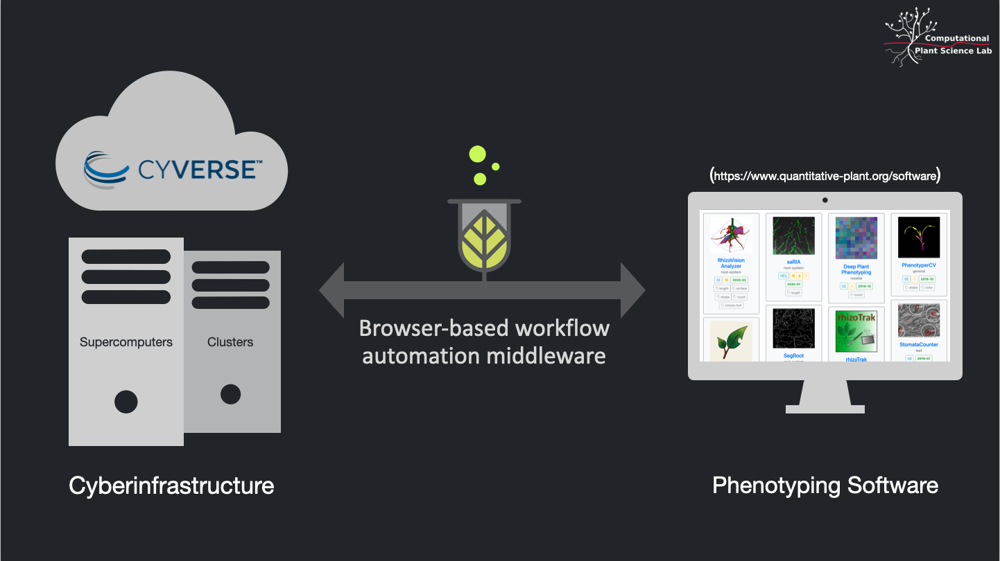
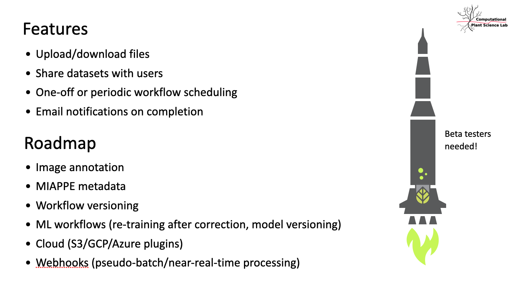

# About PlantIT

<!-- START doctoc generated TOC please keep comment here to allow auto update -->
<!-- DON'T EDIT THIS SECTION, INSTEAD RE-RUN doctoc TO UPDATE -->

- [PlantIT is...](#plantit-is)
- [PlantIT is not...](#plantit-is-not)
- [What can I use it for?](#what-can-i-use-it-for)

<!-- END doctoc generated TOC please keep comment here to allow auto update -->

## PlantIT is...

- a workflow automation tool for computational plant science 
- preceded by &mdash; grew out of, as it were &mdash; [DIRT](http://dirt.cyverse.org/?q=welcome) (**D**igital **I**maging of **R**oot **T**raits), which measures traits of monocot and dicot roots from user-uploaded images, making high-throughput grid computing environments available via web portal
- software-as-a-service: store, publish, and access data with CyVerse, and run simulations and analyses on clusters from a browser
- a platform-as-a-service, integrated with GitHub and Docker: just add a `plantit.yaml` file to your repository to deploy a container to a cluster or supercomputer

## PlantIT is not...

- a pipeline orchestrator (e.g., [Snakemake](https://snakemake.readthedocs.io/en/stable/), [Nextflow](https://www.nextflow.io/), [Luigi](https://luigi.readthedocs.io/en/stable/), [Airflow](https://airflow.apache.org/), [Metaflow](https://metaflow.org/))
- a distributed queue or task scheduler (e.g., [Celery](https://docs.celeryproject.org/en/stable/index.html) or [Dask](https://dask.org/))
- a batch processing, streaming, or analytics platform (e.g., map-reduce or [Spark](https://spark.apache.org/))
- a container automation system (e.g., [Kubernetes](https://kubernetes.io/))
- a cluster scheduler (e.g., [Torque/Moab](https://adaptivecomputing.com/cherry-services/torque-resource-manager/), [Slurm](https://slurm.schedmd.com/overview.html))

It just tries to glue these things together in helpful ways.

## What can I use it for?

PlantIT is flexible enough to run most container-friendly workloads, but if you want to do genomics, an established tool like [CoGe](https://genomevolution.org/CoGe/) or [easyGWAS](https://easygwas.ethz.ch/) may be a better fit. Feel free to [get in touch](https://github.com/Computational-Plant-Science/plantit/discussions) with questions about your use case.

