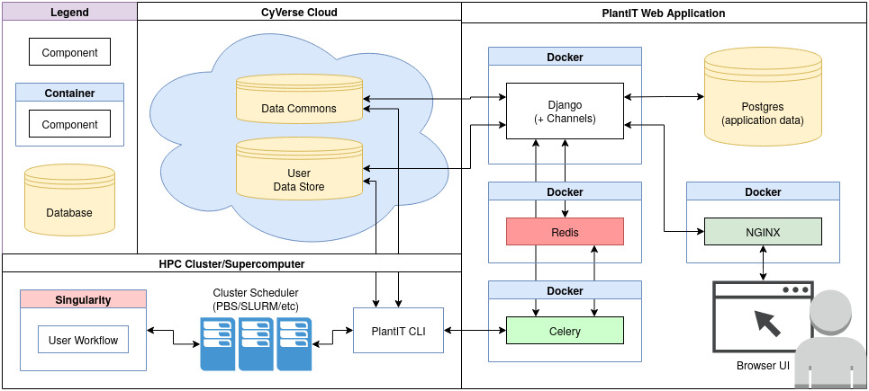

# Architecture

<!-- START doctoc generated TOC please keep comment here to allow auto update -->
<!-- DON'T EDIT THIS SECTION, INSTEAD RE-RUN doctoc TO UPDATE -->

- [Overview](#overview)
- [Dependencies](#dependencies)

<!-- END doctoc generated TOC please keep comment here to allow auto update -->

## Overview

`plantit` is middleware binding GitHub and CyVerse to various institutional clusters & supercomputers via a web interface. The `plantit` stack is predominantly Python, including Django, Gunicorn, Celery, Postgres, Redis, & NGINX, defined with Docker Compose.

There are 3 major abstractions in `plantit`:

- dataset
- workflow
- task

### Datasets

Datasets live in the CyVerse cloud data store. By default, each user has access to their own personal collections, as well as any collections publicly available in the data commons.

### Workflows

Workflows are configured by adding a [`plantit.yaml` file](developer_docs/defining_workflows.md) to any public GitHub repository.

### Tasks

When a task is submitted from the browser, the `plantit` web app hands it to an internal queue feeding a background worker. When the worker picks up the task, a job script is generated and submitted to the selected cluster/supercomputer scheduler. The task lifecycle is a simple state machine strung together from Celery tasks.

