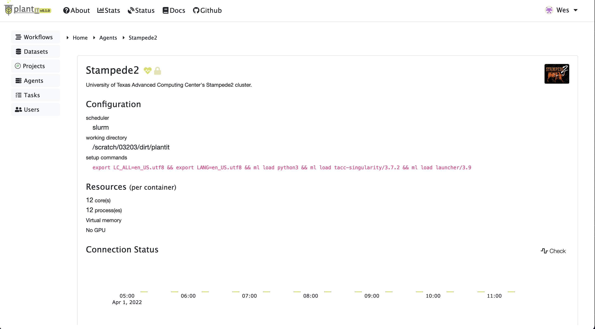

# <i class="fas fa-server fa-1x fa-fw"></i> **Agents**

<!-- START doctoc generated TOC please keep comment here to allow auto update -->
<!-- DON'T EDIT THIS SECTION, INSTEAD RE-RUN doctoc TO UPDATE -->

- [Public agents](#public-agents)
- [Integrating a new agent](#integrating-a-new-agent)

<!-- END doctoc generated TOC please keep comment here to allow auto update -->

An <i class="fas fa-server fa-1x fa-fw"></i> **Agent** runs <i class="fas fa-tasks fa-1x fa-fw"></i> **Tasks.** Abstractly, an agent is a particular way of connecting and submitting to a cluster, supercomputer or server equipped with the SLURM scheduling system. Multiple agents can be configured for the same underlying systems, e.g. to permit submissions to distinct queues.

## Public agents

By default `plantit` provides a single public agent to all users, free of charge, called `Stampede2`.

This agent submits jobs to the Stampede2 cluster at the Texas Advanced Computing Center at the University of Texas. Stampede2 nodes have (up to 96GB of) virtual memory and will ignore workflow-specific memory requests, instead automatically allocating memory as needed. Batch jobs are submitted in parallel where possible to accelerate processing. Completion times may vary widely depending on the cluster's availability and workload at any given moment.

## Integrating a new agent

Please [contact the `plantit` developers](mailto:wbonelli@uga.edu) if you would like to bind a cluster or other deployment target at your institution. User-managed deployment targets must be available via key-accessible SSH &mdash; administrators will be provided a public key to add to their system's SSH server configuration, allowing `plantit` remote access. Clusters may be maintained for private use or made available to all `plantit` users. A future version of `plantit` may support agent management directly in the web UI.
