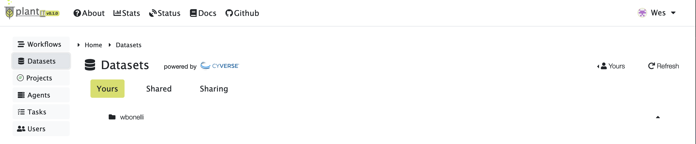
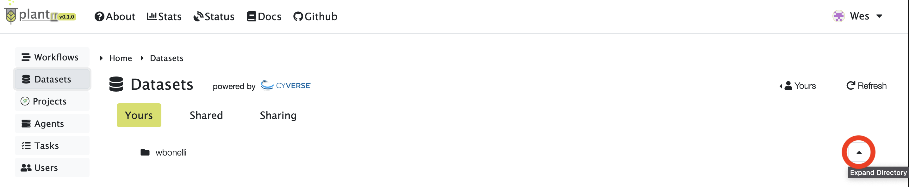
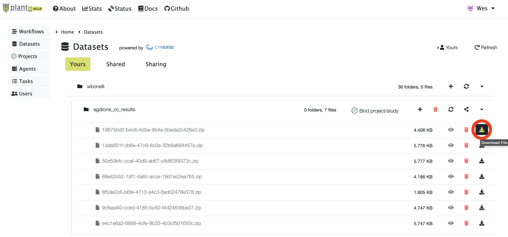
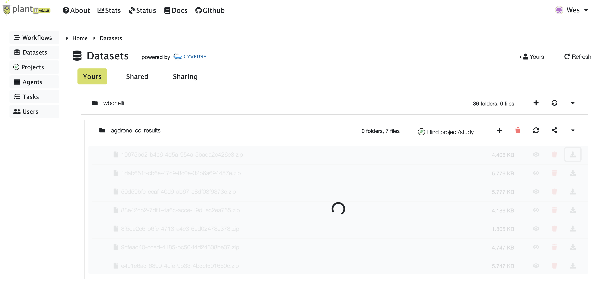
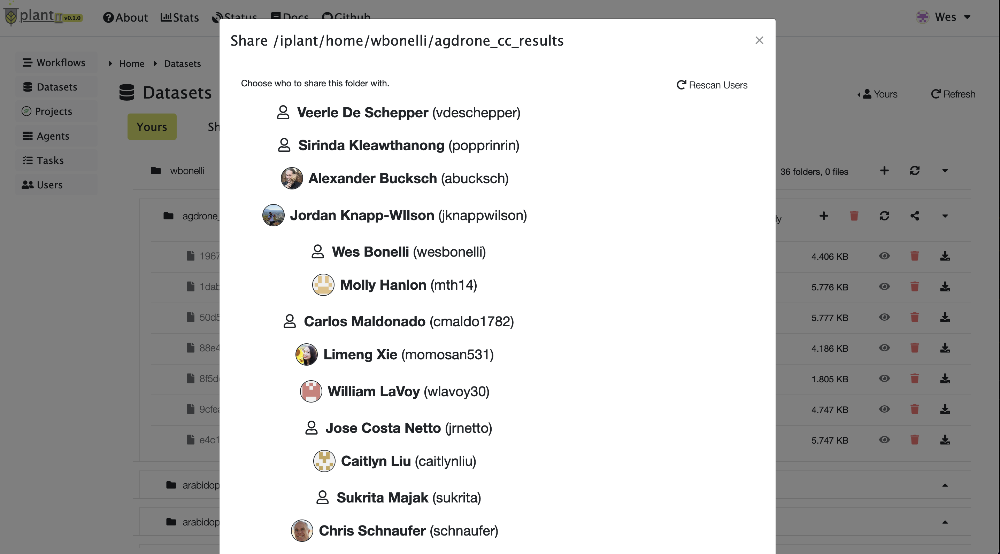
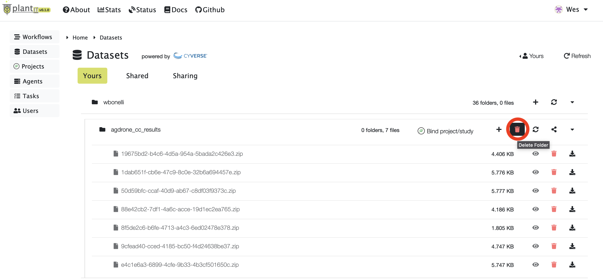

# <i class="fas fa-database fa-1x fa-fw"></i> **Datasets**

<!-- START doctoc generated TOC please keep comment here to allow auto update -->
<!-- DON'T EDIT THIS SECTION, INSTEAD RE-RUN doctoc TO UPDATE -->

- [Viewing data](#viewing-data)
- [Downloading data](#downloading-data)
- [Sharing data](#sharing-data)
- [Deleting data](#deleting-data)

<!-- END doctoc generated TOC please keep comment here to allow auto update -->

A <i class="fas fa-database fa-1x fa-fw"></i> **Dataset** is a folder in the CyVerse data store; whether in the user's personal directory, or in the community `iplant/home/shared/` folder, or in the public data commons.

## Viewing data

To view datasets, navigate to the <i class="fas fa-database fa-1x fa-fw"></i> **Datasets** tab from the home view. This will present a page with three (3) tabs:

- `Yours`: your own personal datasets
- `Shared`: datasets other users have shared with you
- `Sharing`: datasets you're sharing with other users

To expand a folder in the data tree, click the caret button on the right side of the frame.

## Downloading data

To download a file from the CyVerse data store, click the download button on the right side of the menu.

The data tree will disable itself while the file downloads.

Finally a download popup will appear.

## Sharing data

To share a folder with another user, select the share button on the right side of the menu, then select one or more users to share the folder with.

After sharing a folder, the receiving user will be able to access it under their `Shared` datasets tab.

## Deleting data

To delete a personal file or folder in the data store, select the red delete button on the right side of the menu.

