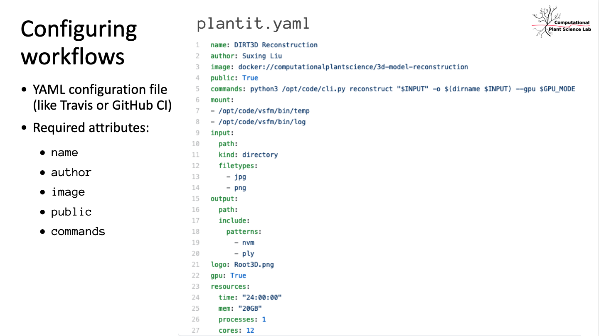

# About `plantit`

<!-- START doctoc generated TOC please keep comment here to allow auto update -->
<!-- DON'T EDIT THIS SECTION, INSTEAD RE-RUN doctoc TO UPDATE -->

- [What is it?](#what-is-it)
- [What isn't it?](#what-isnt-it)
- [What can I use it for?](#what-can-i-use-it-for)

<!-- END doctoc generated TOC please keep comment here to allow auto update -->

## What is it?

PlantIT is a self-service science gateway: a continuous delivery platform for command-line research applications, with a convenient web interface for job submissions.

Developers can add a configuration file to any public [GitHub](https://github.com/) repository to publish a container workflow. Researchers can then run the application from the browser: a batch of Singularity/Apptainer containers can be deployed to a SLURM cluster with a few clicks, seamlessly integrating with the [CyVerse](https://www.cyverse.org/) cloud data store. 

 A [public instance](https://www.cyverse.org/) is hosted by CyVerse. Development is underway to allow teams to host PlantIT on their own infrastructure.

## What isn't it?

`plantit` is none of the following (although it tries to glue these systems together in helpful ways).

- a pipeline orchestrator (e.g., [Snakemake](https://snakemake.readthedocs.io/en/stable/), [Nextflow](https://www.nextflow.io/), [Luigi](https://luigi.readthedocs.io/en/stable/), [Airflow](https://airflow.apache.org/), [Metaflow](https://metaflow.org/))
- a distributed queue or task scheduler (e.g., [Celery](https://docs.celeryproject.org/en/stable/index.html) or [Dask](https://dask.org/))
- a batch processing, streaming, or analytics platform (e.g., map-reduce or [Spark](https://spark.apache.org/))
- a container automation system (e.g., [Kubernetes](https://kubernetes.io/))
- a cluster scheduler (e.g., [Torque/Moab](https://adaptivecomputing.com/cherry-services/torque-resource-manager/), [Slurm](https://slurm.schedmd.com/overview.html))

## What can I use it for?

PlantIT is designed for batch-processing. If your application runs on the command line and can be packaged with Docker, PlantIT likely supports it.

PlantIT does not support:

- interactive applications
- near-real-time streaming
- long-running services

Generally, PlantIT supports workflows which generate some files (optionally from some other files) in a predictable amount of time. PlantIT cannot currently support workflows which require human interaction, which run indefinitely, or which continuously process a stream of data. Workflows may be scheduled to run periodically or at a particular time, offering a limited form of automation.

If PlantIT does not support your use case, consider whether another service may be more appropriate for your needs. For example, [CyVerse](https://www.cyverse.org/) offers a number of prepackaged bioinformatics workflows via the [Discovery Environment](https://de.cyverse.org/).