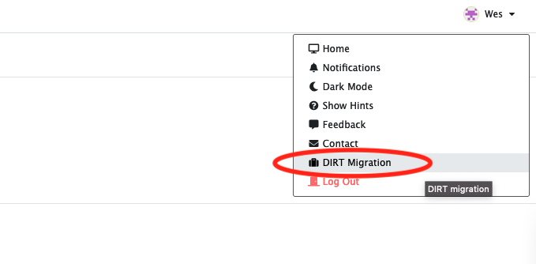

# DIRT Migration

<!-- START doctoc generated TOC please keep comment here to allow auto update -->
<!-- DON'T EDIT THIS SECTION, INSTEAD RE-RUN doctoc TO UPDATE -->

- [Migrating DIRT datasets](#migrating-dirt-datasets)

<!-- END doctoc generated TOC please keep comment here to allow auto update -->

## Migrating DIRT datasets

DIRT users may elect to migrate their datasets stored in the DIRT system to the CyVerse data store for use with `plantit`. This process can be started by selected the drop-down profile menu in the top-right of the `plantit` web UI:

`plantit` will transfer each of your DIRT datasets to a correspondingly named subcollection within a newly created collection in the CyVerse data store. This collection will have path `/iplant/home/{your username}/dirt_migration`. (If for some reason you already have a collection with the same name, you will be prompted to rename it before the migration can proceed.) Once you have started the migration, progress and completion status will be shown onscreen.