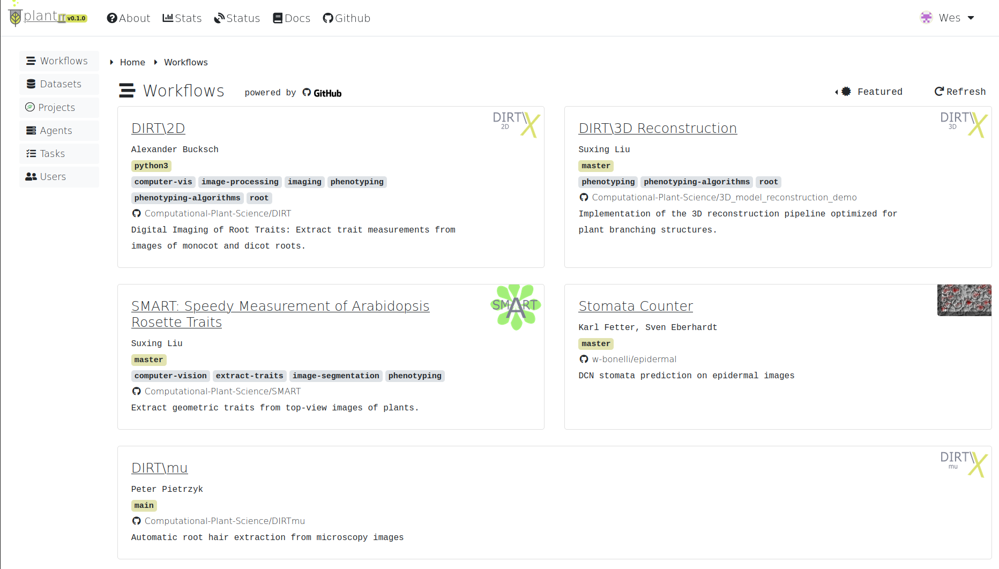
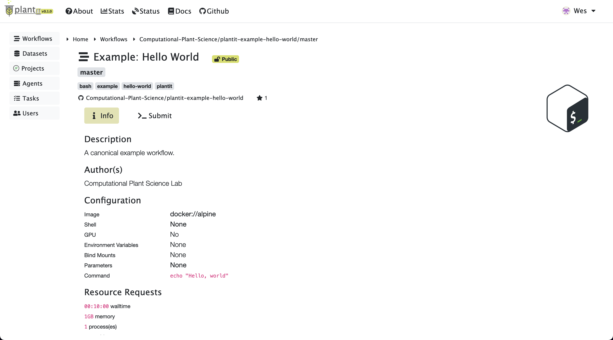
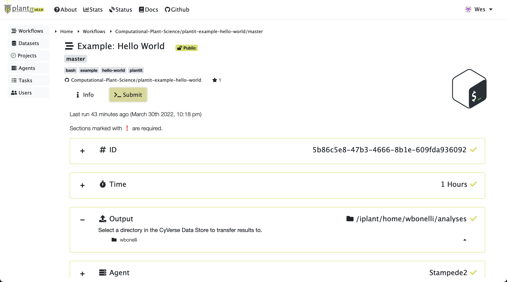
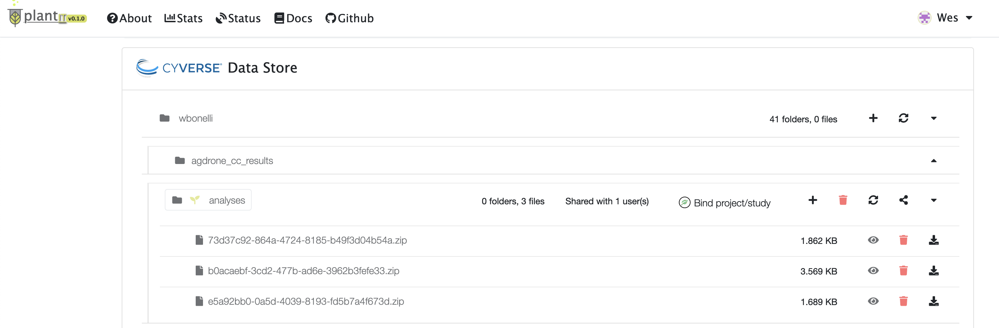

# Quickstart

<!-- START doctoc generated TOC please keep comment here to allow auto update -->
<!-- DON'T EDIT THIS SECTION, INSTEAD RE-RUN doctoc TO UPDATE -->

- [Use cases](#use-cases)
- [Conceptual model](#conceptual-model)
  - [Datasets](#datasets)
  - [Agents](#agents)
  - [Workflows](#workflows)
  - [Tasks](#tasks)
- [Submitting workflows](#submitting-workflows)
  - [Selecting a workflow](#selecting-a-workflow)
  - [Submitting a task](#submitting-a-task)
  - [Monitoring tasks](#monitoring-tasks)
  - [Retrieving results](#retrieving-results)

<!-- END doctoc generated TOC please keep comment here to allow auto update -->

## Use cases

`plantit` aims to support two user groups with different concerns and priorities.

- researchers: analyzing data, running models & simulations (**submitting workflows**)
- developers: publishing and maintaining research software (**publishing workflows**)

With `plantit` the latter group can quickly and easily publish an algorithm to a broader, possibly non-technical user community. In this way it's a continuous deployment tool. It's also a science gateway, hosting plug-and-play algorithms in a web GUI such that any user can leverage XSEDE HPC/HTC clusters for high-throughput phenomics, no programming experience required.

## Conceptual model

`plantit` has a few fundamental abstractions:

- <i class="fas fa-database fa-1x fa-fw"></i> **Dataset**
- <i class="fas fa-server fa-1x fa-fw"></i> **Agent**
- <i class="fas fa-stream fa-1x fa-fw"></i> **Workflow**
- <i class="fas fa-tasks fa-1x fa-fw"></i> **Task**

A <i class="fas fa-database fa-1x fa-fw"></i> **Dataset** is a set of data objects. A <i class="fas fa-stream fa-1x fa-fw"></i> **Workflow** is a containerized research application. A workflow *must* yield a dataset as output and *may* accept one as input (workflows should be designed as functions or generators, *not* for their side effects &mdash; ideally, they should have none). An instantiation of a workflow is called a <i class="fas fa-tasks fa-1x fa-fw"></i> **Task**. An <i class="fas fa-server fa-1x fa-fw"></i> **Agent** is a cluster queue that can run tasks.

### Datasets

A <i class="fas fa-database fa-1x fa-fw"></i> [**Dataset**](datasets.md) is a collection of data objects in the CyVerse data store. 

### Agents

An <i class="fas fa-server fa-1x fa-fw"></i> [**Agent**](agents.md) is a deployment target: an abstraction of a cluster or supercomputer along with SLURM scheduler configuration details.

### Workflows

A <i class="fas fa-stream fa-1x fa-fw"></i> [**Workflow**](workflows.md) is an executable research application packaged into a [Docker](https://www.docker.com/) image. Workflows execute in a [Singularity](https://sylabs.io/singularity/) container runtime. To define a workflow, [add a `plantit.yaml` file to any public GitHub repository](workflows.md).

### Tasks

A <i class="fas fa-tasks fa-1x fa-fw"></i> [**Task**](tasks.md) is an instance of a workflow, deployed to an agent. When a task is submitted from the browser, the `plantit` web app hands it to an internal queue feeding a background process. When the process picks up the task, it generates a job script and submits it to the selected cluster/supercomputer scheduler, then monitors its progress until completion.

The task lifecycle is a state machine progressing from `CREATED` to `RUNNING` to one of several mutually exclusive final states (`COMPLETED`,  `FAILED`, `TIMEOUT`, or `CANCELLED`).

## Submitting workflows

### Selecting a workflow

To explore workflows, navigate to the <i class="fas fa-stream fa-1x fa-fw"></i> **Workflows** tab from the home view.

By default, this page will display the <i class="fas fa-certificate fa-1x fa-fw"></i> **Featured** workflow context: a curated set of applications provided by the Computational Plant Science lab, collaborators, and other researchers. 

Click the <i class="fas fa-certificate fa-1x fa-fw"></i> **Featured** dropdown to select a different context. Options include:

- <i class="fas fa-pin fa-1x fa-fw"></i> **Examples**: a small set of simple workflows to serve as templates and examples
- <i class="fas fa-users fa-1x fa-fw"></i> **Public**: all publicly available workflows
- <i class="fas fa-user fa-1x fa-fw"></i> **Yours**: your own workflows (private and public)
- <i class="fas fa-building fa-1x fa-fw"></i> **[Organization]**: workflows belonging to a particular organization
- <i class="fas fa-sprout fa-1x fa-fw"></i> **[Project]**: workflows associated with a particular MIAPPE project

Select a workflow to view its authorship, related publications, parameter list, and deployment configuration.

### Submitting a task

To configure and submit a task for the workflow you've selected, click <i class="fas fa-terminal fa-1x fa-fw"></i> **Submit**. This will present some configuration options including (at least):

- ID: the task's (unique) identifier
- Tags: arbitrary text tags to associate with the task
- Time: the task's time limit
- Agent: the agent to submit the task to
- Output: the folder to deposit results in

If the workflow requires input files or parameters, corresponding configuration sections will be shown.

After all fields have been configured, click the <i class="fas fa-angle-right fa-1x fa-fw"></i> **Start** button to submit the task.

### Monitoring tasks

After a moment the task page will appear. At first there may be no log messages.

Before long the task should be created, scheduled, and started on the appropriate agent. At this point you should see a few lines of log output:

When a task completes successfully, the status will change from `RUNNING` to `COMPLETED`.

### Retrieving results

The output folder in the CyVerse data store section will eventually open at the bottom of the view (you may need to reload the page). Results will be zipped into a file with name matching the task's ID.

